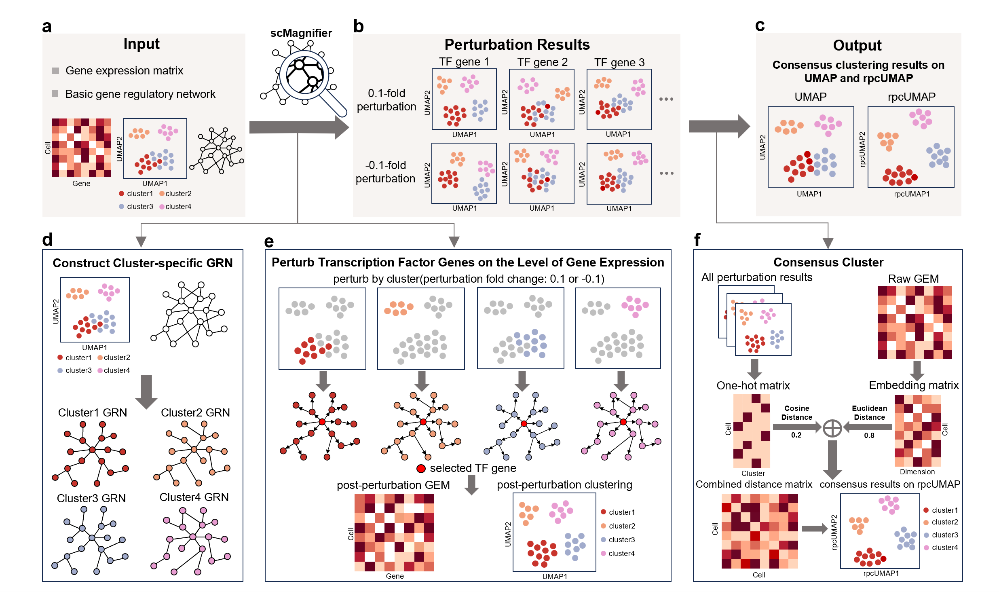

# scMagnifier-main
scMagnifier: resolving fine-grained cell subtypes via GRN-informed perturbations and consensus clustering

  

## Overview
scMagnifier is designed for identifying fine-grained cell subtypes. 
scMagnifier perturbs candidate transcription factors (TFs), propagates perturbation effects through cluster-specific GRNs to simulate post-perturbation expression profiles, and integrates clustering results across multiple perturbations into stable subtype assignments. Additionally, scMagnifier introduces regulatory perturbation consensus UMAP (rpcUMAP), a perturbation-aware visualization that provides clearer separation between cell subtypes and guides the selection of the optimal number of clusters.

## Getting started
See [scMagnifier-Tutorials](https://scmagnifier-tutorial.readthedocs.io/en/latest/)
